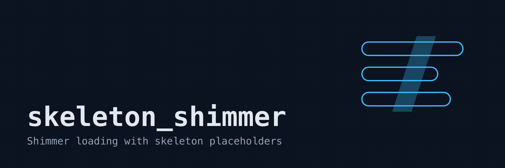

# skeleton_shimmer

Shimmer loading effect for Flutter, API-compatible with the `shimmer`
package, with skeleton placeholder widgets and reduced-motion support.

```dart
import 'package:skeleton_shimmer/skeleton_shimmer.dart';

Shimmer.fromColors(
  baseColor: Colors.grey.shade300,
  highlightColor: Colors.grey.shade100,
  child: const Column(
    crossAxisAlignment: CrossAxisAlignment.start,
    children: [
      SkeletonCircle(size: 48),
      SizedBox(height: 12),
      SkeletonLine(width: 220),
      SizedBox(height: 8),
      SkeletonLine(width: 160),
      SizedBox(height: 16),
      SkeletonBox(height: 120),
    ],
  ),
)
```

## Demo


## Migrating from `shimmer`

The widget API is the same; change the import and the class works as
before:

```dart
// import 'package:shimmer/shimmer.dart';
import 'package:skeleton_shimmer/skeleton_shimmer.dart';
```

`Shimmer`, `Shimmer.fromColors`, `ShimmerDirection` (`ltr`, `rtl`,
`ttb`, `btt`), `period`, `loop`, and `enabled` all behave the way you
expect.

## What is different

- **Reduced motion**: when the platform asks for it
  (`MediaQuery.disableAnimations`, e.g. iOS Reduce Motion), the sweep
  freezes on the base color instead of animating.
- **Skeleton primitives**: `SkeletonBox`, `SkeletonCircle`, and
  `SkeletonLine` cover the usual placeholder shapes, so most screens
  need no custom containers.
- **Tested**: animation lifecycle (loop counts, enable/disable,
  reduced-motion transitions) and the band geometry itself (a
  pixel-level test asserts the sweep window matches the original) are
  covered by widget tests.

## Skeleton primitives

| Widget | Shape |
|---|---|
| `SkeletonBox(width, height, borderRadius)` | Rounded rectangle |
| `SkeletonCircle(size)` | Circle, e.g. avatar |
| `SkeletonLine(width, height)` | Pill-shaped text line |

All take a `color` (default: a light gray for the shimmer to paint
over). Null `width`/`height` fills the available space when the
incoming constraints are bounded.

## Notes

- The sweep re-orients only `LinearGradient`s; a custom non-linear
  `Gradient` passed to the default constructor is used as given, without
  the directional slide.
- `loop: 0` (default) repeats until the widget is disposed or
  `enabled: false`.

## Credits

The API design and sweep geometry follow the
[shimmer](https://pub.dev/packages/shimmer) package by HungHD (hnvn);
this is an independent implementation.

## License

MIT
