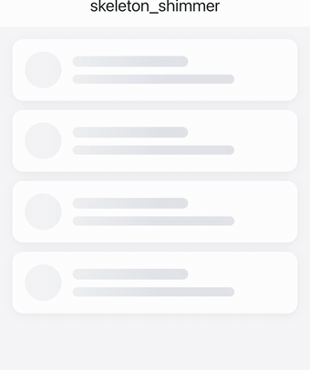
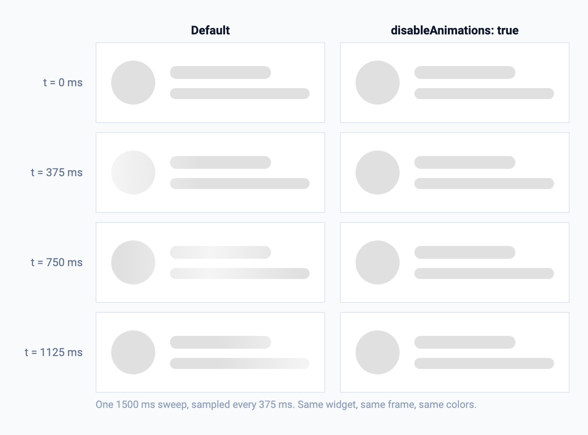

# skeleton_shimmer

Shimmer loading effect for Flutter, API-compatible with the `shimmer`
package, with skeleton placeholder widgets and reduced-motion support.

```dart
import 'package:skeleton_shimmer/skeleton_shimmer.dart';

Shimmer.fromColors(
  baseColor: Colors.grey.shade300,
  highlightColor: Colors.grey.shade100,
  child: const Column(
    crossAxisAlignment: CrossAxisAlignment.start,
    children: [
      SkeletonCircle(size: 48),
      SizedBox(height: 12),
      SkeletonLine(width: 220),
      SizedBox(height: 8),
      SkeletonLine(width: 160),
      SizedBox(height: 16),
      SkeletonBox(height: 120),
    ],
  ),
)
```

## Demo



## Migrating from `shimmer`

The widget API is the same; change the import and the class works as
before:

```dart
// import 'package:shimmer/shimmer.dart';
import 'package:skeleton_shimmer/skeleton_shimmer.dart';
```

`Shimmer`, `Shimmer.fromColors`, `ShimmerDirection` (`ltr`, `rtl`,
`ttb`, `btt`), `period`, `loop`, and `enabled` all behave the way you
expect.

## What is different

- **Reduced motion**: the sweep freezes instead of animating when the
  platform asks for it. [What that looks like, and what ignoring it
  costs.](#reduced-motion)
- **Screen readers**: the placeholder shapes stay out of the semantics
  tree, since a skeleton is decoration standing in for content that has
  not arrived, and a run of empty containers is nothing but an obstacle
  to walk past. Pass `semanticsLabel` to announce the loading state
  instead:

  ```dart
  Shimmer.fromColors(
    baseColor: base,
    highlightColor: highlight,
    semanticsLabel: AppLocalizations.of(context).loading,
    child: const SkeletonLine(width: 200),
  )
  ```

  It works like `CircularProgressIndicator.semanticsLabel`, including
  having no default: the package cannot invent a localized string, so it
  stays quiet rather than announcing English into every app. The label is
  a live region, so it is read when the skeleton appears rather than only
  when focus reaches it.
- **Skeleton primitives**: `SkeletonBox`, `SkeletonCircle`, and
  `SkeletonLine` cover the usual placeholder shapes, so most screens
  need no custom containers.
- **Tested**: animation lifecycle (loop counts, enable/disable,
  reduced-motion transitions) and the band geometry itself (a
  pixel-level test asserts the sweep window matches the original) are
  covered by widget tests.

## Reduced motion



Each row is one frame. The left card sits under the ambient `MediaQuery` and
the right one under `disableAnimations: true`: the sweep stops, the gradient
mask stays, so the placeholders still preview the layout that is coming.

Your app wires nothing up for this. `MediaQueryData.fromView` fills the flag
in from `AccessibilityFeatures.disableAnimations` and `Shimmer` reads it. Two
things are worth knowing anyway:

- **Ignoring the flag is worse than it sounds.** While it is set,
  `AnimationController.forward()` runs its duration at 5% by default
  (`AnimationBehavior.normal`), so a shimmer that kept sweeping would restart
  every 75 ms instead of every 1500 ms. Measured on Flutter 3.41.
- **Override `MediaQuery` with `copyWith`.** A fresh `MediaQueryData(...)`
  anywhere above a `Shimmer` resets `disableAnimations` to false, and then the
  sweep runs for someone who asked it not to.

`example/lib/main.dart` has a switch that turns the flag on for the feed below
it, so both states are visible on a machine that has the setting switched off.
The figure comes from `tool/capture_reduced_motion.sh`, and that run asserts the
two columns really do behave differently before it writes the file.

## Skeleton primitives

| Widget | Shape |
|---|---|
| `SkeletonBox(width, height, borderRadius)` | Rounded rectangle |
| `SkeletonCircle(size)` | Circle, e.g. avatar |
| `SkeletonLine(width, height)` | Pill-shaped text line |

All take a `color` (default: a light gray for the shimmer to paint
over). Null `width`/`height` fills the available space when the
incoming constraints are bounded.

## Notes

- A custom `Gradient` passed to the default constructor is used exactly
  as given; the sweep comes from sliding the paint window across the
  child, so it applies to any gradient type.
- `loop: 0` (default) repeats until the widget is disposed or
  `enabled: false`.

## Credits

The API design and sweep geometry follow the
[shimmer](https://pub.dev/packages/shimmer) package by HungHD (hnvn);
this is an independent implementation.

## License

MIT
